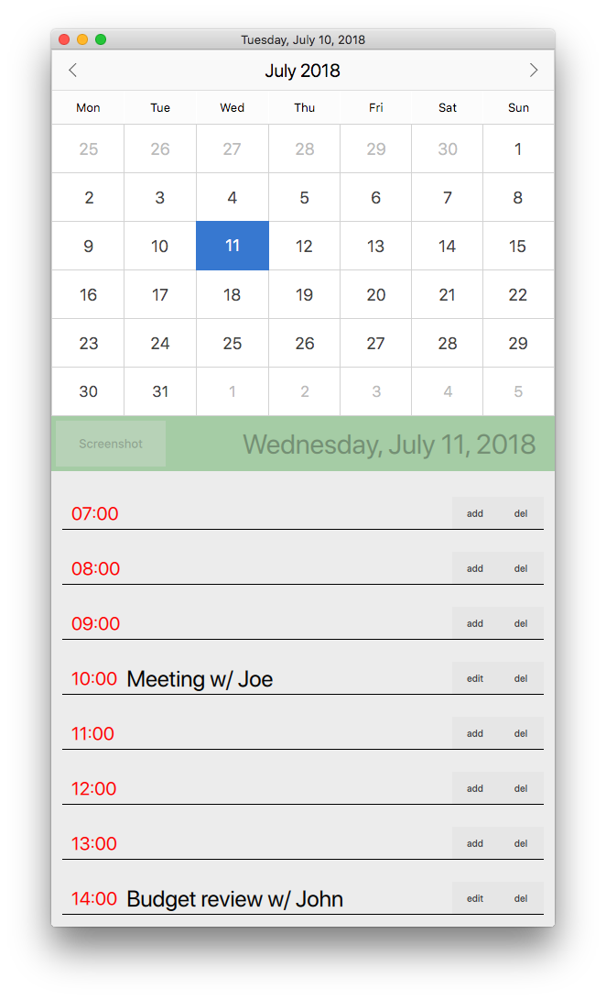
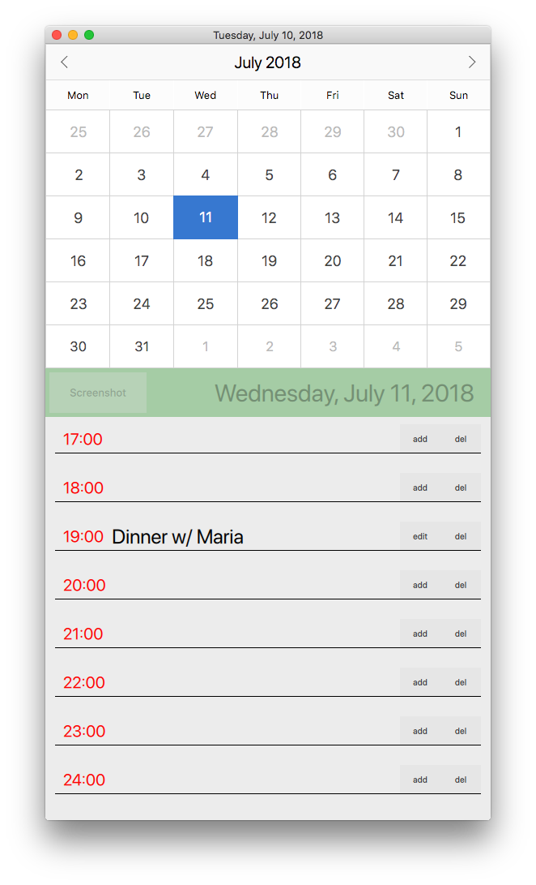
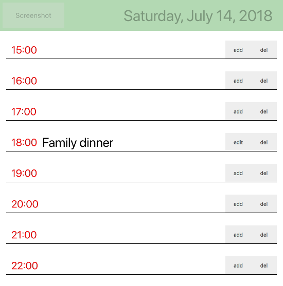

# myqtcalendar

myqtcalendar is a simple calendar app which makes use of the Calendar widget provided by the QtQuick.Controls module as well as a local database to manage the calendar events created by the user. The user can add, edit or delete events on a certain time in a certain date. It's also making use of the [qmlsnapshot](https://github.com/alexandraB99/qmlsnapshot) lib as a third party library enabling taking screenshots of the events list of the selected date.

# Building myqtcalendar
``mkdir build && cd build``

From the *build* folder, run:  
``
path/to/your/Qt/bin/qmake ../qtcalendar/
``  

then:  
``make && make install``

This will create the *myqtcalendar* executable under the *bin* directory inside the build folder.

# Running the application
From the *build* folder, run
``
./bin/myqtcalendar
``

#### morningSchedule.png  
  
#### eveningSchedule.png  
  
#### dayScheduleScreenshot.png  
  

# License
This software is available under the following licenses:
GNU GENERAL PUBLIC LICENSE
Version 3, 29 June 2007
